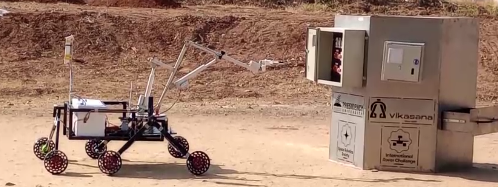

# Yuvaan GUI 🚀

Welcome to the Yuvaan GUI project, a web app designed to control the YUVAAN Mars rover developed by the Robotics Club at IIT Guwahati. 🌌

## Features 🛰️

The Yuvaan GUI offers an array of features that facilitate seamless control and monitoring of the Mars rover:

- 📹 **Continuous Video Feed**: Watch direct video streaming from the rover's onboard cameras, transmitted directly to the base station.

- 🌡️ **Sensor Data Monitoring**: Stay informed about the rover's environment with sensor reading, including temperature, humidity, atmospheric pressure, and more.

- 🕹️ **Remote Control**: Take charge of the rover's movements by sending control commands through the app's intuitive interface. Drive the rover, adjust its orientation.

- 🎮 **Gamepad Integration**: Connect a gamepad to your device and use it to control the rover just like a joystick, adding an extra layer of realism to the exploration experience.

- 🔄 **Actuator Feedback Visualization**: Dynamic animations that visualize feedback from the rover's actuators.

## Tech Stack 💻

- **Flutter Framework**: The app is built using the Flutter framework, allowing for a smooth and engaging user interface.

- **WebSocket Communication**: Flutter WebSocket is utilized to establish a robust and low-latency connection between the app and the ROS (Robot Operating System) WebSocket running on the rover.

## Getting Started 🚀

To begin using Yuvaan GUI, follow these steps:

### Prerequisites

Before you begin, ensure you have the following:

- **Flutter Environment**: Make sure you have Flutter installed on your development machine. If not, you can [install Flutter](https://flutter.dev/docs/get-started/install) following the official guide.

### Installation

1. Clone this repository to your local machine using:

   ```bash
   git clone https://github.com/yourusername/Yuvaan-GUI.git
   ```

2. Navigate to the project directory:
   ```bash
   cd Yuvaan-GUI
   ```
3. Install the required dependencies:
   ```bash
   flutter pub get
   ```

## Running the app

1. Select chrome or edge as a device to run this project.
2. Run the app
   ```bash
       flutter run
   ```

Note: This project does not use Dart null safety. It runs on Flutter version 3.7.0 and Dart version 2.19.0, without null safety enabled.

##


